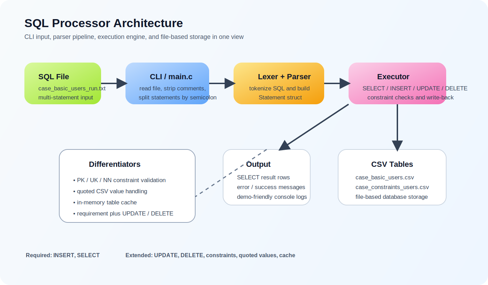
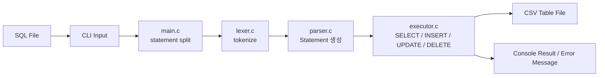

# SQLprocessor

> SQL 텍스트 파일을 입력받아 파싱하고, 실행하고, CSV 파일에 저장하는 C 기반 SQL 처리기입니다.



## 프로젝트 요약

| 항목 | 내용 |
| --- | --- |
| 주제 | SQL Processor 구현 |
| 목표 | `입력(SQL)` -> `파싱` -> `실행` -> `파일 저장` 흐름 완성 |
| 구현 언어 | C |
| 저장 방식 | CSV 기반 파일 DB |
| 필수 요구사항 | `INSERT`, `SELECT`, CLI 입력, 파일 저장 |
| 추가 구현 | `UPDATE`, `DELETE`, `PK/UK/NN` 제약, quoted CSV 처리, 테이블 캐시 |

## 발표 한 줄 메시지

이 프로젝트는 "DB가 SQL을 받아 실제 데이터를 바꾸는 흐름"을 가장 작게 직접 구현한 결과물입니다.  
핵심은 AI로 빠르게 만들었더라도, `왜 이렇게 동작하는지`를 코드 단위로 설명할 수 있게 만드는 데 있습니다.

## 처리 흐름



## 핵심 설계

| 구성 요소 | 역할 | 발표 포인트 |
| --- | --- | --- |
| `main.c` | SQL 파일을 읽고 `;` 기준으로 문장을 분리 | 작은 DB 엔진의 진입점 |
| `lexer.c` | 문자열을 토큰으로 분해 | SQL을 구조적으로 읽기 위한 첫 단계 |
| `parser.c` | 토큰을 `Statement` 구조체로 변환 | 문법 해석과 실행 데이터 준비 |
| `executor.c` | SELECT/INSERT/UPDATE/DELETE 실행 | 실제 데이터 변경과 검증 담당 |
| `*.csv` | 테이블 저장소 | 별도 DB 없이도 동작 흐름 재현 |

## 요구사항 대비 구현 결과

| 요구사항 | 구현 결과 |
| --- | --- |
| SQL 파일을 CLI로 입력 | `./sqlproc_demo <sql-file>` 형태로 실행 |
| SQL 파싱 | `Statement` 구조체로 파싱 |
| 최소 지원: INSERT | 구현 완료 |
| 최소 지원: SELECT | 구현 완료 |
| 파일 기반 저장 | `<table>.csv` 파일에 저장 |
| schema / table은 이미 존재한다고 가정 | CSV 헤더를 schema처럼 사용 |
| 품질 검증 | 기능 테스트 케이스 다수 구성 |

## 차별점

| 포인트 | 설명 |
| --- | --- |
| 제약조건 처리 | `PK`, `UK`, `NN` 위반을 실행 단계에서 차단 |
| quoted value 처리 | `'tony,stark@test.com'`처럼 쉼표가 포함된 값도 파싱 가능 |
| 캐시 구조 | 테이블을 메모리에 적재 후 재사용 |
| 추가 SQL 지원 | 요구사항 이상으로 `UPDATE`, `DELETE`까지 구현 |
| 명확한 오류 메시지 | 잘못된 문장과 제약 위반을 콘솔에 즉시 표시 |

## 테스트 시연 시나리오

| 시나리오 | 파일 | 확인 포인트 |
| --- | --- | --- |
| 정상 흐름 | `case_basic_users_run.txt` | 조회 -> 삽입 -> 수정 -> 삭제 |
| 제약 검증 | `case_constraints_users_run.txt` | PK/UK/NN 위반 차단 |
| 따옴표/쉼표 | `case_quotes_users_run.txt` | quoted CSV 값 처리 |
| 문법 오류 | `case_invalid_users_run.txt` | 잘못된 SQL 문장 거부 |

발표에서는 `정상 흐름 + 제약 검증`만 시연해도 핵심이 충분히 전달됩니다.

## 실행 방법

```bash
gcc -fdiagnostics-color=always -g main.c lexer.c parser.c executor.c -o sqlproc_demo

./sqlproc_demo case_basic_users_reset.txt
./sqlproc_demo case_basic_users_run.txt

./sqlproc_demo case_constraints_users_reset.txt
./sqlproc_demo case_constraints_users_run.txt
```

## 실제 시연에서 보여줄 결과

| 테스트 | 기대 결과 |
| --- | --- |
| Basic Run | 행이 추가되고, 수정되고, 다시 삭제된 뒤 원상 복구됨 |
| Constraints Run | 중복 PK/UK, 빈 NN 값은 거부되고 정상 데이터만 반영됨 |
| Invalid Run | 잘못된 문장은 즉시 파싱 오류로 종료됨 |

## 발표에서 강조할 핵심 3가지

1. 이 프로젝트는 단순한 CSV 편집기가 아니라, SQL을 해석하고 실행하는 작은 DB 처리기입니다.
2. 최소 요구사항은 `INSERT`, `SELECT`였지만, 실제 구현은 `UPDATE`, `DELETE`, 제약조건까지 확장했습니다.
3. 빠른 구현만이 아니라 테스트 케이스로 정상 흐름과 예외 흐름을 함께 검증했습니다.

## 함께 보면 좋은 문서

- [학습 가이드](docs/STUDY_GUIDE.md)
- [3분 30초 발표 대본](docs/PRESENTATION_SCRIPT.md)
